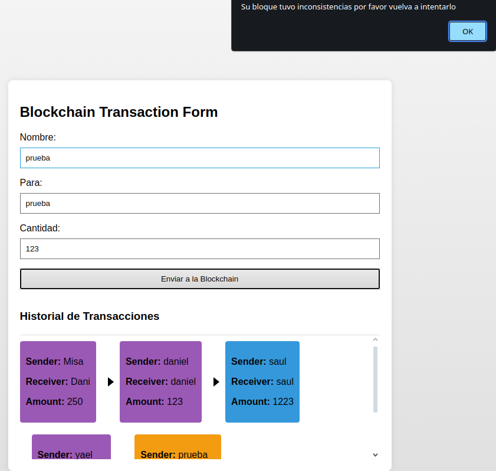

# Blockchain de utilizando el paradigma paralelo
## Universidad Nacional Autónoma de México

### Desarrollado por **Misael Ramos Navarrete** estudiante de la licenciatura en Ciencia de Datos 

1. [¿Que es la blockchain?](#¿que-es-la-blockchain)
2. [Aplicación](#aplicación)
   1. [Paralelización de hilos](#paralelización-de-hilos)
   2. [Cliente Servidor](#cliente-servidor)
   3. [Paso de mensajes](#paso-de-mensajes)
3. [Función](#función)
   1. [App](#app)
   2. [Tiempo](#tiempo)
   3. [Bloques erroneos](#bloques-erroneos)
4. [Instalación](#instalación)
5. [Fin](#fin) 

## ¿Que es la blockchain?  
Esta estructura opera mediante bloques de transacciones registradas por millones de usuarios, funcionando de manera similar a una lista ligada. En este contexto, dos hashes actúan como punteros: uno corresponde al hash del bloque de transacción actual y otro señala al bloque anterior. La obtención de estos hashes implica la resolución de problemas complejos. Sin embargo, el aspecto crucial radica en las validaciones de estos bloques, las cuales son llevadas a cabo por millones de usuarios para garantizar la corrección del bloque generado, es decir, que los hashes de los bloques coincidan.

](images/Exponencial.png)

Para propósitos prácticos, se tomó la decisión de emplear el algoritmo de hash SHA-256, dado su rendimiento eficiente y su facilidad de implementación en Java, ya que se encuentra integrado de forma nativa en el lenguaje.

## Aplicación

En este punto, opté por intervenir aplicando los conceptos abordados en clase, tales como el paso de mensajes, la arquitectura cliente-servidor, y la paralelización de hilos.

### Paralelización de Hilos

La decisión adoptada consistió en paralelizar la validación de los bloques. Los hilos del procesador desempeñarán el papel de otros usuarios, participando en la validación para confirmar que el bloque y sus respectivos hash son correctos.

](<images/Exponencial - Page 1.png>)

Haciendo uso de Java para llevar a cabo este procedimiento, se implementa una función de validación para garantizar la integridad del bloque generado. A continuación, se presenta una sección del código relevante:

``` java
    private ExecutorService executorService;
    public Validate(){
        this.executorService = Executors.newCachedThreadPool();
    }
    public void validateConcurrentlyAndRemoveInvalidBlocks(List<Block> block, BlockChain blockChain ) {
        int numBlocks = block.size();

        // Crear tantos hilos como bloques en la cadena
        for (int i = 0; i < numBlocks; i++) {
            executorService.submit(() -> blockChain.validateAndRemoveBlock(numBlocks-1));
        }

        // Esperar a que todos los hilos completen
        executorService.shutdown();
        try {
            executorService.awaitTermination(Long.MAX_VALUE, TimeUnit.NANOSECONDS);
        } catch (InterruptedException e) {
            e.printStackTrace();
        }
    }
```

Esta función desempeña un papel fundamental en la validación de los bloques. Como se puede observar, su complejidad no excede la tarea de crear varios hilos, cada uno con la única misión de validar bloques. No obstante, ¿cómo opera este proceso?

``` java 
     public void validateAndRemoveBlock(int blockIndex) {
        Block currentBlock = blockchain.get(blockIndex);
        Block previousBlock = blockchain.get(blockIndex - 1);
        
        if (random.nextDouble() < 0.01 ||
            !currentBlock.getPreviousHash().equals(previousBlock.getHash()) ||
            !currentBlock.getHash().equals(currentBlock.calculateHash())) {
            // Eliminar el bloque si la validación falla
            try {
                blockchain.remove(blockIndex);
                System.out.println("Removing block #" + blockIndex);    
            } catch (Exception e) {
                System.out.println("Bloque ya eliminado anteriormente");
            }
        }
    }
```
Una vez que se ha creado el bloque, se obtiene y se verifica que su hash y el del bloque anterior sean iguales. Sin embargo, dado que se utiliza SHA-256, que no tiene un índice de error real, se ha incorporado una probabilidad de fallo del 1%. En caso de que la verificación falle, se decide eliminar el bloque de la cadena, logrando así simular una blockchain.

Con esta implementación, se ha llevado a cabo la primera parte del proyecto, que consistió en la paralelización de hilos.

### Cliente Servidor

Una vez creada y desarrollada la sección paralela, se procede a crear un servidor cliente que operará en una página HTML con JavaScript, utilizando el servidor **UNDERTOW** y **MAVEN** como gestor de paquetes Java. Más adelante se abordará la instalación del proyecto, por el momento continuaremos con la explicación del mismo.

En este servidor, la única interacción establecida entre el servidor y el cliente consiste en un intercambio de mensajes con las transacciones generadas en la página. En Java, se recibe esta información, se crea el bloque y se verifica su validez.

A continuación, se muestra una sección del código correspondiente a esta implementación.

```java 
// Obtenemos las partes del a guardar en la block chain
    String[] Parts = message.split("\\|");
    String Sender = Parts[0];
    String Receiver = Parts[1];
    String Amount = Parts[2];
                            
```
En esta sección, el mensaje enviado por la página se descompone en sus elementos constituyentes, tales como el remitente, el destinatario y la cantidad de la transacción.

```java
    //Creamos un objeto de transacción y la añadimos a la blockcchian
    List<Transaction> trasactions = new ArrayList<>();

    trasactions.add(new Transaction(Sender, Receiver, (double) Integer.parseInt(Amount)));

    chain.addBlock(trasactions);

    Block lastBlocBefore = chain.getBlockchain().get(chain.getBlockchain().size()-1);


```

En esta sección, se lleva a cabo la creación de un nuevo bloque de transacción y su posterior envío a la cadena de bloques.

```java
    //Validamos que sea correcto de forma concurrente y guardamos si lo fue o no
    Validate validar = new Validate();
    validateSec validateSec = new validateSec();
    // validación de tiempos de respues
    long timeConcurrentInit = System.currentTimeMillis(); 
    validar.validateConcurrentlyAndRemoveInvalidBlocks(chain.getBlockchain(), chain);
    long timeConcurrentEnd = System.currentTimeMillis() - timeConcurrentInit; 

    long timeSecuenInit = System.currentTimeMillis();
    validateSec.validateAndRemoveBlock(chain.getBlockchain().size()-1, chain.getBlockchain());
    long timeSecuenEnd = System.currentTimeMillis()-timeSecuenInit;
```

Finalmente, se procede a instanciar los validadores concurrentes y secuenciales con el propósito de medir los tiempos de espera asociados.

### Paso de mensajes

Con la información proporcionada y después de validar el bloque, se procede a enviar la información a la página, indicando si la operación del bloque fue exitosa o, en su defecto, si no fue agregado a la cadena.

```java
    if(lastBlocBefore == lastBloc){
        // caso contrario obtenemos los datos del ultimo bloque añadido y lo mandamos a consola
        Sender = lastBloc.getTransactions().get(0).getSender();
        Receiver = lastBloc.getTransactions().get(0).getReceiver();
        String Hash = lastBloc.getHash();
        String PreviousHash = lastBloc.getPreviousHash();
        Amount = String.valueOf(lastBloc.getTransactions().get(0).getAmount());
        exchange.getResponseSender().send("LastBlock => \nSender: "+Sender+" \nReceiver " + Receiver + " \nAmout: " +Amount+ " \nPrevious Hash: " + PreviousHash+" \nHash: "+Hash+"\n\nSize Blockchain: " +chain.getBlockchain().size()+" \n\nTiempo concurrente: "+String.valueOf(timeConcurrentEnd) +" Tiempo secuencial: " +String.valueOf(timeSecuenEnd));
    }else{
        exchange.getResponseSender().send("Bloque Incorrecto"+" Tiempo concurrente: "+(timeConcurrentEnd) +" Tiempo secuencial: " +String.valueOf(timeSecuenEnd));
    }
```
Con esta estructura condicional, se verifica si la operación de eliminar o agregar el bloque se llevó a cabo con éxito. Además, se genera una cadena formateada con la información del bloque para su visualización en la consola del navegador, incluyendo los tiempos de ejecución.

Ahora procedamos a examinar el código JavaScript de la página para entender cómo se envían los mensajes al servidor.

```javascript
function Enviar(sender,receiver,amount){
    fetch( 'http://localhost:8080/?mensaje=' + sender +"|"+ receiver +"|"+ amount ) // URL reconocida por la aplicación java principal
    .then(response => {
        if (!response.ok) {
            throw new Error('La solicitud no pudo ser completada correctamente.');
        }
        return response.text();  // debe ser "text" en minúsculas
        //return response.json(); // Si se espera una respuesta JSON
    })
    .then(data => {
        if(data.startsWith("Bloque Incorrecto")){
            console.log(data)
            alert("Su bloque tuvo inconsistencias por favor vuelva a intentarlo")
        }else{
            console.log(data);
            submitTransaction(sender,receiver,amount);
        }                
        
    })
    .catch(error => {
        alert('Hubo un error al realizar la solicitud:');  // Muestra error en pantalla
        // console.error('Hubo un error al realizar la solicitud:', error);  // Manda error a la consola del navegador
    });

}
```
En la función subsiguiente, se envían los datos separados por '|' al servidor. En el caso en que este retorne un mensaje que comienza con "Bloque incorrecto", se notifica al usuario sobre las inconsistencias detectadas en su bloque, mientras que los detalles se registran en la consola.

En el escenario opuesto, donde la información formateada se envía a la consola del navegador, se invoca la función **"submitTransaction"** para actualizar la página con el nuevo bloque creado.

# Función
## App
El cliente luce de la siguiente manera 

<p align="center">
  
</p>

Se trata de un formulario que incluye el nombre del remitente, del destinatario y la cantidad a enviar.

Al generar una transacción y proceder al envío, obtenemos el siguiente resultado.

<p align="center">
    
</p>

Al percatarnos de la adición de un bloque de color que exhibe información adicional, al dirigirnos a la consola del navegador, nos encontramos con los siguientes datos registrados.

```bash
LastBlock => 
Sender: Misa 
Receiver Dani 
Amout: 250.0 
Previous Hash: 9ff9b10bae1b94cf0e8d82c23151d92bb7e5ce3a4f84143d28b0ab14b3391 
Hash: 9b168154d82b1c9f889e5f42c6d6cf990e23213d18757d3c10851e793b31

Size Blockchain: 1

Tiempo concurrente: 2 Tiempo secuencial: 3
```
## Tiempo
Observamos que se nos brinda información detallada sobre la transacción, incluyendo los hashes generados para el bloque, el tamaño de la cadena y los tiempos de ejecución asociados con ambas validaciones.

```bash
LastBlock => 
Sender: Misa 
Receiver Dani 
Amout: 250.0 
Previous Hash: 9ff9b10bae1b94cf0e8d82c23151d92bb7e5ce3a4f84143d28b0ab14b3391 
Hash: 9b168154d82b1c9f889e5f42c6d6cf990e23213d18757d3c10851e793b31

Size Blockchain: 2

Tiempo concurrente: 2 Tiempo secuencial: 3
(index):221 LastBlock => 
Sender: daniel 
Receiver daniel 
Amout: 123.0 
Previous Hash: 9b168154d82b1c9f889e5f42c6d6cf990e23213d18757d3c10851e793b31 
Hash: 49a46d52215d67be53d84d915345768d71dc54bdbc28bbcff16a78a9f87c38

Size Blockchain: 3 

Tiempo concurrente: 1 Tiempo secuencial: 3
(index):221 LastBlock => 
Sender: saul 
Receiver saul 
Amout: 1223.0 
Previous Hash: 49a46d52215d67be53d84d915345768d71dc54bdbc28bbcff16a78a9f87c38 
Hash: b064d58b20d23d779680fde97aee99638d588588a1ce8dea9e9b37818aefe2

Size Blockchain: 4

Tiempo concurrente: 1 Tiempo secuencial: 3
(index):221 LastBlock => 
Sender: yael 
Receiver yael 
Amout: 12344.0 
Previous Hash: b064d58b20d23d779680fde97aee99638d588588a1ce8dea9e9b37818aefe2 
Hash: 8e8c4f1b9f26ef414cafb5ea9be61c4f780a5fe9f1bbbe97fde0a6724b50e0

Size Blockchain: 5

Tiempo concurrente: 1 Tiempo secuencial: 4
(index):221 LastBlock => 
Sender: prueba 
Receiver prueba 
Amout: 523.0 
Previous Hash: 8e8c4f1b9f26ef414cafb5ea9be61c4f780a5fe9f1bbbe97fde0a6724b50e0 
Hash: 9d91cb309e9c588c8122f247fcb2fdc9d53345722c69fa65a496ce1332d589

Size Blockchain: 6

Tiempo concurrente: 2 Tiempo secuencial: 3

```
Es importante destacar que los tiempos de ejecución están expresados en milisegundos. Se evidencia una notable diferencia entre ambos modelos, con una mejora del 33.3%, no obstante, tras realizar múltiples pruebas, se constata que la mejora es del 66.6% en términos de la mediana, proporcionando así una perspectiva más precisa de la eficiencia del sistema.

## Bloques erroneos
Examinemos, asimismo, el escenario en el cual la adición de un bloque resulta infructuosa y, como consecuencia, se procede a su eliminación.

<p align="center">
    
</p>

En el escenario presente, se constata la imposibilidad de añadir el bloque, siendo notificado de tal incidencia directamente en la página. La consola, por su parte, arroja el siguiente resultado como evidencia de dicho contratiempo.

```bash
    Bloque Incorrecto Tiempo concurrente: 1 Tiempo secuencial: 3
```
# Instalación
En último lugar, procedemos a abordar la instalación del proyecto:

1. Descargue el repositorio o realice una clonación a través de Git en su consola, seleccionando el directorio de su preferencia.
2. Es requisito indispensable contar con la instalación previa de **Maven** en su equipo.
3. Una vez que haya clonado o descargado el repositorio, abra su consola de preferencia y sitúese en el directorio que contiene el proyecto. A continuación, ejecute el siguiente comando para compilar y construir el proyecto:
    ```bash
    mvn
    ```
4. Posteriormente, ejecute el siguiente comando para ejecutar el proyecto:
    ```bash
    mvn exec:java
    ```
En caso de no haber experimentado inconvenientes con los códigos previos, ahora tiene la capacidad de acceder al proyecto mediante el navegador de su elección, simplemente dirigiéndose a la siguiente ruta: http://localhost:8080.

# Fin
Podemos inferir, por consiguiente, que la implementación de la programación paralela ha contribuido de manera significativa a la reducción de los tiempos de espera, evidenciando mejoras substanciales en la ejecución del programa relacionado con la tecnología blockchain. En este contexto, se observa la aplicación efectiva de varios conceptos abordados en el ámbito académico, tales como el modelo cliente-servidor, la transferencia de mensajes, y la paralelización de hilos.